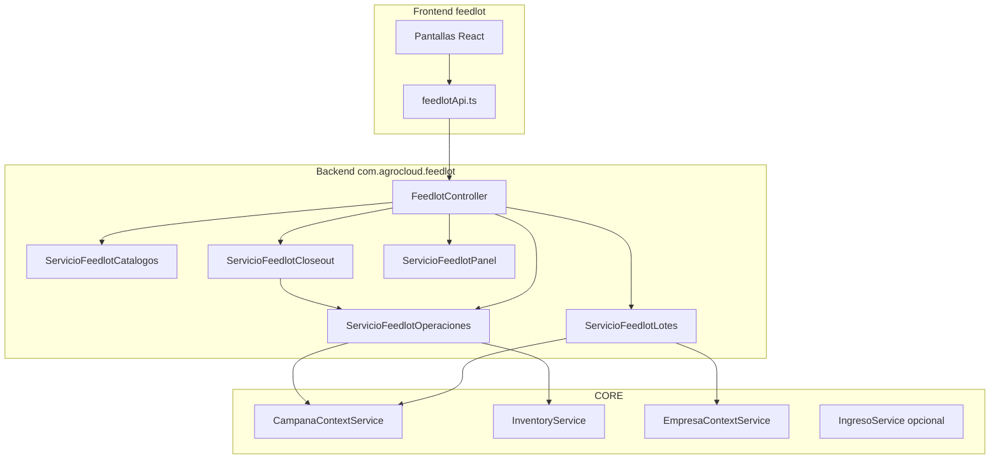
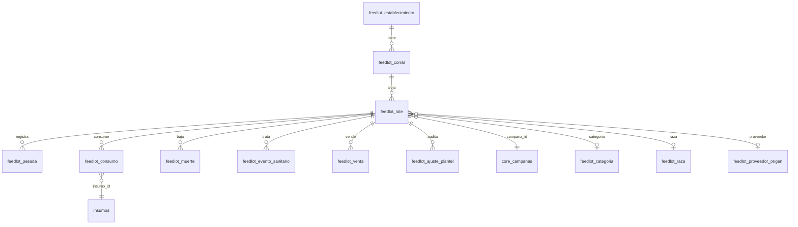

# Diseño técnico — Módulo Feedlot (v1)

**Versión:** 1.0  
**Fecha:** Junio 2026  
**Metodología:** SDD  
**Estado:** Aprobada (v1.0, Junio 2026)  
**SPEC funcional:** `SPEC-MODULO-FEEDLOT.md` (Aprobada v1.0)

---

## 1. Objetivo del documento

Definir la implementación técnica de v1 del módulo **Engorde a corral (Feedlot)** antes de escribir código: esquema de datos, capas backend, contratos API, integraciones CORE, estructura frontend y tests mínimos.

---

## 2. Decisiones técnicas derivadas de la SPEC

| Decisión | Implicación técnica |
|----------|---------------------|
| Solo lote (R01) | Sin tablas de caravana ni `feedlot_movimiento_corral` en v1 |
| Mortalidad descuenta plantel (R02) | `cabezasActuales` se decrementa en servicio de muertes |
| 1 lote/corral (R03–R04) | Unique constraint lógico: corral con lote `ACTIVO` |
| Consignación flag (R05) | Campos en `feedlot_lote`; sin job de facturación v1 |
| Closeout deads-in (R06) | Fórmulas fijas en `ServicioFeedlotCloseout` v1 |
| MS opcional (R07) | Columna `materia_seca_pct` nullable |
| Precio opcional (R08) | Closeout económico parcial si faltan precios |
| UI «Engorde a corral (Feedlot)» (R10) | `ModuleConfig.nombre` y registro en `modules.name` |

---

## 3. Arquitectura de capas



**Referencia de código existente:**

| Patrón | Referencia |
|--------|------------|
| Controller + `@RequiresModule` | `AvicolaCarneController.java` |
| Dominio aislado + prefijo | `avicola/huevos/*`, migración `V1_137` |
| Consumo + inventario | `ServicioAvicolaPonedorasOperaciones.java` |
| Resumen KPI | `AvicolaCarneResumenRespuesta.java` |
| Módulo frontend | `modules/avicola-huevos/` |

---

## 4. Migración Flyway

**Archivo:** `agrogestion-backend/src/main/resources/db/migration/V1_153__Modulo_feedlot.sql`

### 4.1 Registro de módulo

```sql
INSERT INTO modules (name, code, description, active)
SELECT 'Engorde a corral (Feedlot)', 'FEEDLOT',
       'Engorde bovino a corral: lotes, pesadas, alimento, sanidad, faena y closeout.',
       TRUE
WHERE NOT EXISTS (SELECT 1 FROM modules WHERE code = 'FEEDLOT');
```

No habilitar automáticamente en todas las empresas (a diferencia de V1_140 avícola); el admin activa `FEEDLOT` por empresa vía `company_modules`.

### 4.2 Diagrama ER (v1)



### 4.3 DDL resumido

**Catálogos** — todas con `empresa_id`, `activo`, `created_at`, `updated_at`:

- `feedlot_establecimiento` (`nombre`, `ubicacion`, `capacidad_total_cabezas`)
- `feedlot_corral` (`establecimiento_id` FK, `nombre`, `capacidad_cabezas`, `estado` VARCHAR(20))
- `feedlot_categoria`, `feedlot_raza`, `feedlot_motivo_muerte`
- `feedlot_proveedor_origen` (`tipo` VARCHAR(30))

**Lote:**

```sql
CREATE TABLE feedlot_lote (
  id BIGINT AUTO_INCREMENT PRIMARY KEY,
  empresa_id BIGINT NOT NULL,
  corral_id BIGINT NOT NULL,
  campana_id BIGINT NOT NULL,
  nombre VARCHAR(120) NOT NULL,
  categoria_id BIGINT NULL,
  raza_id BIGINT NULL,
  proveedor_id BIGINT NULL,
  tipo_tenencia VARCHAR(20) NOT NULL DEFAULT 'PROPIO',
  fecha_ingreso DATE NOT NULL,
  fecha_cierre DATE NULL,
  cabezas_inicial INT NOT NULL,
  cabezas_actuales INT NOT NULL,
  peso_promedio_ingreso_kg DECIMAL(10,2) NOT NULL,
  precio_compra_kg DECIMAL(12,2) NULL,
  costo_hoteleria_dia DECIMAL(12,2) NULL,
  estado VARCHAR(20) NOT NULL DEFAULT 'ACTIVO',
  observaciones TEXT NULL,
  created_at TIMESTAMP NOT NULL DEFAULT CURRENT_TIMESTAMP,
  updated_at TIMESTAMP NULL ON UPDATE CURRENT_TIMESTAMP,
  CONSTRAINT fk_feedlot_lote_corral FOREIGN KEY (corral_id) REFERENCES feedlot_corral(id),
  CONSTRAINT fk_feedlot_lote_campana FOREIGN KEY (campana_id) REFERENCES core_campanas(id),
  INDEX idx_feedlot_lote_empresa_estado (empresa_id, estado),
  INDEX idx_feedlot_lote_campana (campana_id),
  INDEX idx_feedlot_lote_corral (corral_id)
);
```

**Operaciones** — FK `lote_id` → `feedlot_lote`, índices por `(lote_id, fecha)`:

| Tabla | Campos clave |
|-------|--------------|
| `feedlot_pesada` | `fecha`, `peso_promedio_kg`, `cabezas_muestreadas` |
| `feedlot_consumo` | `campana_id`, `insumo_id`, `fecha`, `cantidad_kg`, `materia_seca_pct`, `movimiento_inventario_id` (nullable, trazabilidad reversión) |
| `feedlot_muerte` | `fecha`, `cabezas`, `motivo_id` |
| `feedlot_evento_sanitario` | `fecha`, `tipo`, `descripcion`, `insumo_id`, `dias_retiro` |
| `feedlot_venta` | `campana_id`, `fecha`, `tipo`, `cabezas`, `peso_promedio_kg`, `precio_kg`, `total`, `comprador`, `ingreso_id` |
| `feedlot_ajuste_plantel` | `fecha`, `cabezas_antes`, `cabezas_despues`, `motivo`, `usuario_id` |

### 4.4 Enum Java (no DDL)

Ampliar [`InventoryOrigin.java`](agrogestion-backend/src/main/java/com/agrocloud/core/inventory/domain/InventoryOrigin.java):

```java
FEEDLOT
```

---

## 5. Backend — paquete `com.agrocloud.feedlot`

### 5.1 Estructura de directorios

```
com/agrocloud/feedlot/
├── controller/
│   └── FeedlotController.java
├── model/
│   ├── entity/          # Entidades JPA
│   ├── enums/           # FeedlotLoteEstado, FeedlotCorralEstado, FeedlotTipoTenencia, ...
│   └── dto/             # Solicitud/Respuesta por recurso
├── repository/          # JpaRepository por entidad
└── service/
    ├── ServicioFeedlotCatalogos.java
    ├── ServicioFeedlotLotes.java
    ├── ServicioFeedlotOperaciones.java
    ├── ServicioFeedlotCloseout.java
    └── ServicioFeedlotPanel.java
```

### 5.2 Servicios — responsabilidades

#### `ServicioFeedlotCatalogos`

- CRUD establecimientos, corrales, categorías, razas, motivos muerte, proveedores.
- Validar `empresa_id` vía `EmpresaContextService`.
- Corral: no eliminar físico si tiene lotes; soft-delete con `INACTIVO`.

#### `ServicioFeedlotLotes`

| Método | Lógica |
|--------|--------|
| `listarLotes(estado, delPeriodoActivo, corralId)` | Filtro empresa; si `delPeriodoActivo=true`, campaña del header |
| `crearLote(solicitud)` | Validar corral `DISPONIBLE`; asignar `campana_id`; `cabezasActuales = cabezasInicial`; corral → `OCUPADO` |
| `actualizarLote(id, solicitud)` | Solo lote `ACTIVO`; no cambiar corral en v1 |
| `cerrarLote(id, confirmacion)` | Si `cabezasActuales > 0`, requiere flag confirmación; estado → `CERRADO`; corral → `DISPONIBLE` |
| `obtenerLote(id)` | Detalle con joins catálogos |

**Validación corral ocupado:**

```java
if (corralRepository.existsByIdAndEstado(corralId, OCUPADO)) {
    throw new ConflictException("El corral ya tiene un lote activo");
}
```

#### `ServicioFeedlotOperaciones`

Transaccional (`@Transactional`). Patrón similar a `ServicioAvicolaCarneOperaciones` con reglas feedlot.

| Operación | Efecto plantel | Inventario |
|-----------|----------------|------------|
| Pesada | — | — |
| Consumo | — | `InventoryService.egresar(..., FEEDLOT, consumoId)` |
| Muerte | `cabezasActuales -= cabezas` | — |
| Venta | `cabezasActuales -= cabezas`; si 0 → cierre lote | — |
| Sanidad (+ insumo) | — | egreso opcional |
| Ajuste plantel | actualiza `cabezasActuales` | — |

**Consumo — reversión (RN-C04):**

- Al editar: revertir movimiento anterior por `movimiento_inventario_id`, crear nuevo egreso.
- Al eliminar: revertir movimiento y borrar fila consumo.

#### `ServicioFeedlotCloseout`

Entrada: `loteId`. Salida: `FeedlotCloseoutRespuesta`.

**Campos calculados v1 (deads-in):**

```text
diasEnFeedlot = fechaReferencia - fechaIngreso
pesoActual = ultimaPesada.peso ?? pesoPromedioIngreso
gmd = (pesoActual - pesoIngreso) / diasEnFeedlot
totalMuertes = sum(muertes.cabezas)
mortalidadPct = totalMuertes / cabezasInicial * 100
totalAlimentoKg = sum(consumos.cantidadKg)
totalAlimentoMsKg = sum(consumos donde materiaSecaPct != null)
kgGanados = (pesoActual - pesoIngreso) * cabezasInicial  // deads-in: base cabezas iniciales
conversion = totalAlimentoKg / kgGanados
headDays = promedio(cabezas por intervalo) * dias  // v1 simplificado ver §7.9 SPEC
costoCompra = cabezasInicial * pesoIngreso * precioCompraKg  // si precio informado
costoAlimento = sum(consumos * precioUnitarioInsumo)
costoHoteleria = headDays * costoHoteleriaDia  // si consignación
ingresosVentas = sum(ventas.total)
margen = ingresosVentas - costoAcumulado
breakevenKg = costoAcumulado / (cabezasVendidas * pesoVentaPromedio)  // si aplica
```

#### `ServicioFeedlotPanel`

Agregados del período activo: cabezas en feed, lotes activos, GMD promedio, mortalidad %, consumo total.

### 5.3 DTOs principales

| DTO | Uso |
|-----|-----|
| `FeedlotLoteSolicitud` / `FeedlotLoteRespuesta` | Alta/edición/listado |
| `FeedlotPesadaSolicitud` / `FeedlotPesadaRespuesta` | Pesadas |
| `FeedlotConsumoSolicitud` / `FeedlotConsumoRespuesta` | Consumos |
| `FeedlotMuerteSolicitud` | Mortalidad |
| `FeedlotVentaSolicitud` / `FeedlotVentaRespuesta` | Ventas |
| `FeedlotEventoSanitarioSolicitud` | Sanidad |
| `FeedlotAjustePlantelSolicitud` | Ajuste admin |
| `FeedlotResumenRespuesta` | KPIs lote (pestaña resumen) |
| `FeedlotCloseoutRespuesta` | Closeout completo |
| `FeedlotPanelRespuesta` | Dashboard |

### 5.4 Controller

**Base:** `/api/feedlot`  
**Anotación:** `@RequiresModule("FEEDLOT")` a nivel clase; `@RequiresModule(value = "FEEDLOT", permission = "write")` en POST/PUT/PATCH/DELETE.

Endpoints según SPEC §9 — un solo controller en v1; dividir en v2 si crece.

**Seguridad adicional:**

- `POST /lotes/{id}/ajustes-plantel` → rol `ADMIN` o `SUPERVISOR` (mismo patrón que ajustes en otros módulos).
- Interceptor campaña cerrada (existente en CORE) aplica automáticamente.

### 5.5 Integraciones CORE

| Servicio CORE | Uso en feedlot |
|---------------|----------------|
| `EmpresaContextService` | `empresaId` en todas las consultas |
| `CampanaContextService` | `campana_id` al crear lote/consumo/venta |
| `InventoryService` | Egresos consumo y sanidad con medicamento |
| `IngresoService` (opcional) | Crear ingreso al registrar venta con precio |
| Header `X-Campaign-Id` | Frontend envía en escrituras (patrón existente) |

---

## 6. Frontend — módulo `feedlot`

### 6.1 Registro

| Archivo | Cambio |
|---------|--------|
| [`module.types.ts`](agrogestion-frontend/src/core/types/module.types.ts) | Añadir `'feedlot'` a `ModuleId` |
| [`conceptosTemporalesPorModulo.ts`](agrogestion-frontend/src/core/config/conceptosTemporalesPorModulo.ts) | Entrada `feedlot` |
| Registro central de módulos (donde se importan `avicolaHuevosModule`, etc.) | `feedlotModule` |

```typescript
export const feedlotModule: ModuleConfig = {
  id: 'feedlot',
  nombre: 'Engorde a corral (Feedlot)',
  descripcion: 'Engorde bovino: corrales, lotes, alimento, pesadas, faena y closeout.',
  icono: 'Beef', // o icono equivalente disponible
  color: '#b45309',
  menu: feedlotMenu,
  routes: feedlotRoutes,
};
```

### 6.2 Estructura

```
modules/feedlot/
├── index.ts
├── menu.ts
├── routes.ts
├── services/
│   └── feedlotApi.ts
├── pages/
│   ├── FeedlotDashboardScreen.tsx
│   ├── EstablecimientosFeedlotScreen.tsx
│   ├── CorralesFeedlotScreen.tsx          # o sub-ruta bajo establecimiento
│   ├── CategoriasFeedlotScreen.tsx
│   ├── RazasFeedlotScreen.tsx
│   ├── ProveedoresFeedlotScreen.tsx
│   ├── LotesFeedlotScreen.tsx
│   ├── FeedlotLoteFormScreen.tsx          # alta + edición
│   ├── DetalleLoteFeedlotScreen.tsx       # pestañas operativas
│   └── InsumosFeedlotScreen.tsx           # wrapper InsumosUnificados
└── components/
    ├── FeedlotCloseoutModal.tsx
    ├── TablaPesadasFeedlot.tsx
    ├── TablaConsumosFeedlot.tsx
    └── ... (formularios por operación)
```

### 6.3 Pantallas v1 — comportamiento

| Pantalla | Comportamiento clave |
|----------|---------------------|
| Dashboard | KPIs de `/panel/resumen`; filtro período activo |
| Lotes | Listado con `delPeriodoActivo`; botón «Nuevo lote» |
| Formulario lote | Selector corral solo `DISPONIBLE`; campos consignación condicionales |
| Detalle lote | Pestañas: Resumen, Pesadas, Consumos, Muertes, Sanidad, Ventas |
| Resumen | KPIs + botón «Ver closeout» |
| Closeout modal | GET `/lotes/{id}/closeout`; tabla costos/ingresos/margen |
| Períodos | Reutilizar `GestionCampanasScreen` con `incrustado` |

### 6.4 API client (`feedlotApi.ts`)

Axios con base `/api/feedlot`; incluir header `X-Campaign-Id` desde contexto campaña (patrón `avicolaHuevosApi.ts`).

---

## 7. Tests mínimos (backend)

Ubicación sugerida: `agrogestion-backend/src/test/java/com/agrocloud/feedlot/`

| Clase test | Escenarios |
|------------|------------|
| `ServicioFeedlotLotesTest` | Alta lote ocupa corral; rechaza segundo lote en corral ocupado; cierre libera corral |
| `ServicioFeedlotOperacionesTest` | Muerte descuenta cabezas; venta parcial; venta total cierra lote |
| `ServicioFeedlotOperacionesConsumoTest` | Egreso inventario; rollback stock insuficiente; reversión al editar |
| `ServicioFeedlotCloseoutTest` | GMD, conversión, deads-in con muertes |
| `FeedlotControllerIntegracionTest` | POST con campaña cerrada → 400; sin módulo FEEDLOT → 402; con módulo → 200 |

### 7.1 QA E2E manual (browser)

- **Preparación (plataforma):** SUPERADMIN habilita `FEEDLOT` en AgroCloud Demo — `scripts/HABILITAR_FEEDLOT_EMPRESA_DEMO.sql`.
- **Recorrido funcional:** **`admin@agrocloud.com`** (administrador de empresa), empresa **AgroCloud Demo**. Alineado con `GUIA_DEMO_CLIENTE.md`.
- **No usar superman** para panel, lotes, closeout ni reportes: bypass de `@RequiresModule` en `ModuleAccessInterceptor`.
- Checklist: SPEC §15 y `scripts/README-FEEDLOT-DEMO.md`.

---

## 8. Orden de implementación

| Fase | Entregable | Dependencias |
|------|------------|--------------|
| 1 | `V1_153__Modulo_feedlot.sql` + `InventoryOrigin.FEEDLOT` | Aprobación diseño |
| 2 | Entidades JPA + repositories | Fase 1 |
| 3 | `ServicioFeedlotCatalogos` + endpoints catálogos | Fase 2 |
| 4 | `ServicioFeedlotLotes` + CRUD lotes | Fase 3 |
| 5 | `ServicioFeedlotOperaciones` + inventario | Fase 4 |
| 6 | `ServicioFeedlotCloseout` + panel | Fase 5 |
| 7 | Tests backend | Fases 4–6 |
| 8 | Módulo frontend completo | Fases 3–6 |
| 9 | QA E2E manual (criterios SPEC §15) | Fase 8 |

**Estimación:** 8–12 semanas (1 dev full-stack o backend + frontend en paralelo).

---

## 9. Fuera de alcance v1 (recordatorio)

- Caravana, RFID, app móvil offline
- Bunk score, dietas automáticas, closeout PDF
- Facturación hotelería automática
- Expediente `FEEDLOT_LOTE` (v1.5)
- `Plot` cultivos como corral
- Tabla `feedlot_movimiento_corral`

---

## 10. Riesgos técnicos

| ID | Riesgo | Mitigación |
|----|--------|------------|
| T01 | Head days simplificado impreciso | Documentar en UI; refinar v1.5 con intervalos por evento |
| T02 | Precio insumo para costo alimento | Usar `precioUnitario` de `Insumo` al momento del consumo |
| T03 | Concurrencia dos altas mismo corral | Transacción + lock optimista en corral o unique partial index |
| T04 | Enum `InventoryOrigin` en movimientos históricos | Solo agregar valor; no migrar datos existentes |

---

## 11. Criterios de aceptación del diseño

- [x] ER y DDL alineados con SPEC §6.1–6.2.
- [x] Servicios cubren reglas RN-* aprobadas.
- [x] API coincide con SPEC §9.
- [x] Frontend v1 cubre pantallas críticas §10 SPEC.
- [x] Integraciones CORE identificadas sin acoplar CORE a feedlot.
- [x] Tests mínimos definidos antes de implementar.

**Estado implementación:** v1 operativa + v1.5 analítica completadas (Junio 2026). QA E2E manual pendiente con `admin@agrocloud.com` (SPEC §15).

---

**Aprobación diseño técnico:** Stakeholders — **Junio 2026**

Implementación v1 autorizada según SDD.
