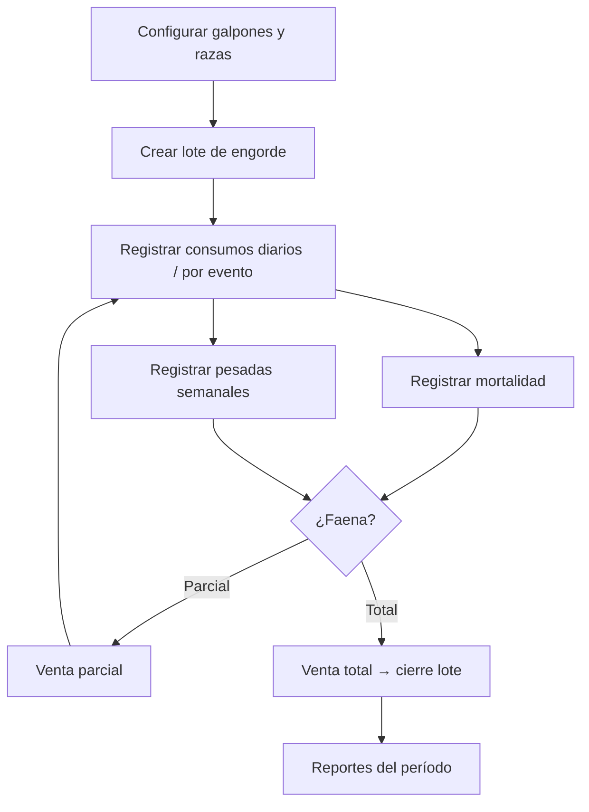

# SPEC — Módulo Avícola Carne (engorde / parrillero)

**Versión:** 1.0  
**Fecha:** Junio 2026  
**Metodología:** SDD  
**Estado:** Pendiente de aprobación  
**Referencia modelo:** `SPEC-MODULO-AVICOLA-HUEVOS.md` (estructura de módulo autocontenido)  
**Relacionada con:** `SPEC-MODULO-AVICOLA-CRIANZA.md`, `SPEC-CAMPANA-TRANSVERSAL.md`, `SPEC-EXPEDIENTE-TRAZABILIDAD-CICLO-VIDA.md`

---

## 1. Objetivo

Gestionar **engorde avícola** (pollos parrilleros y equivalentes): ciclo batch desde ingreso de pollitos hasta faena o venta en pie, con registro de **pesadas**, **mortalidad**, **consumo de alimento** (inventario CORE), **sanidad** y **indicadores zootécnicos** (conversión alimenticia, mortalidad %, días en galpón).

El módulo debe ser **operable de punta a punta** por el productor avícola, con la misma madurez funcional que el módulo de **huevos** (catálogos, lotes, detalle operativo, reportes, calendario, períodos).

---

## 2. Glosario agronómico

| Término | Definición |
|---------|------------|
| **Lote de engorde** | Unidad operativa batch: un ingreso homogéneo de aves en un galpón, con ciclo de 35–50 días típico. |
| **Período de gestión** | Misma entidad `core_campanas` (`SPEC-CAMPANA-TRANSVERSAL`). En UI: «Período de gestión»; agrupa lotes y movimientos económicos. |
| **Pesada** | Registro de peso promedio (muestra o total) en una fecha; base para proyección de faena y GMD. |
| **Mortalidad** | Baja por muerte natural/enfermedad; en carne **no descuenta** `cantidadAnimales` (registro informativo para KPI). |
| **Venta / faena** | Salida comercial de aves; **descuenta** plantel y puede **cerrar** el lote. |
| **Conversión alimenticia (CA / FCR)** | kg alimento consumido ÷ (peso vivo × aves disponibles). |
| **GMD** | Ganancia media diaria = (peso actual − peso ingreso) ÷ días en galpón. |
| **EPEF** (v2) | Índice europeo de eficiencia productiva. |

---

## 3. Módulo y seguridad

| Concepto | Valor |
|----------|--------|
| Código en `modules.code` | `AVICOLA_CARNE` |
| `@RequiresModule` | `"AVICOLA_CARNE"` |
| Origen inventario CORE | `InventoryOrigin.AVICOLA_CARNE` |
| API base | `/api/avicola-carne` |
| Paquete Java | `com.agrocloud.avicola.carne` |
| Frontend | `agrogestion-frontend/src/modules/avicola-carne` |

---

## 4. Situación actual (línea base)

### 4.1 Implementado

**Backend**

- `AvicolaCarneController` — lotes CRUD, operaciones hijas, resumen KPI.
- `ServicioAvicolaCarneLotes` — delega en `ServicioAvicolaCrianzaLote`.
- `ServicioAvicolaCarneOperaciones` — reglas propias en muertes, ventas y consumos; pesadas/sanidad vía crianza.
- Repositorios nativos sobre tablas `avicola_*` compartidas con crianza.
- Filtro `delPeriodoActivo` en listado de lotes.
- Migración `V1_140__Modulos_avicola_carne_y_ponedoras.sql` (registro en catálogo `modules`).

**Frontend**

- Panel resumen (`AvicolaCarneDashboard`) — KPIs agregados.
- Listado de lotes con filtro por estado y período activo.
- Detalle de lote con pestañas: Resumen, Pesadas, Muertes, Ventas, Consumos, Sanidad.
- Exportación de operaciones del lote.
- Períodos de gestión (`GestionCampanasScreen`).
- Trazabilidad configurada para `AVICOLA_CARNE`.

### 4.2 Pendiente / stub

| Ítem | Estado |
|------|--------|
| Formulario alta de lote | **Stub** (`AvicolaCarneLoteNuevoPlaceholder`) |
| Establecimientos (CRUD en módulo) | No existe pantalla; depende de crianza |
| Razas / líneas de engorde (CRUD) | No existe pantalla |
| Insumos dentro del módulo | No existe pantalla |
| Reportes empresa (FCR, mortalidad, comparativa lotes) | No existe backend ni pantalla |
| Calendario con ámbito `AVICOLA_CARNE` | Usa calendario genérico |
| Cierre explícito de lote (`POST /lotes/{id}/cierre`) | Solo cierre automático al faenar 100 % |
| Edición de consumos con reversión inventario | No implementado (sí en huevos) |
| Dominio de datos aislado (`avicola_carne_*`) | No; comparte `avicola_*` con crianza |

---

## 5. Decisión arquitectónica de datos

### 5.1 Fase 1 (v1 — alcance aprobado para implementación inmediata)

**Reutilizar tablas `avicola_*` de crianza** (`SPEC-MODULO-AVICOLA-CRIANZA`), con capa de servicio `avicola.carne` que aplica reglas de negocio propias.

**Condición de uso:** la empresa opera **solo** módulo carne **o** solo crianza, **o** acepta que ambos módulos vean los mismos lotes en `avicola_lote`.

**Mitigación si coexisten crianza + carne:** agregar columna `modulo_origen` (`AVICOLA_CRIANZA` | `AVICOLA_CARNE`) en `avicola_lote` y filtrar listados por módulo (migración futura, ver §10).

### 5.2 Fase 2 (v2 — opcional, modelo huevos)

Tablas propias `avicola_carne_*` (establecimiento, raza, lote, pesada, muerte, venta, consumo, evento_sanitario), sin FK a crianza ni huevos. Aplicable si se requiere **aislamiento total** entre módulos avícolas en la misma empresa.

---

## 6. Entidades y tablas (fase 1)

Reutiliza esquema `avicola_*` (`V1_136`, `V1_148`, `V1_149`):

| Tabla | Uso en carne |
|-------|----------------|
| `avicola_establecimiento` | Galpones / naves de engorde |
| `avicola_raza` | Líneas parrilleras (Cobb, Ross, etc.) |
| `avicola_lote` | Lote batch; `campana_id` al crear |
| `avicola_pesada` | Curva de crecimiento |
| `avicola_muerte` | Mortalidad (informativa) |
| `avicola_venta` | Faena / venta en pie |
| `avicola_consumo` | Alimento e insumos; `campana_id` heredado |
| `avicola_evento_sanitario` | Vacunas, tratamientos, diagnósticos |

---

## 7. Reglas de negocio

### 7.1 Lote

| Regla | Detalle |
|-------|---------|
| RN-L01 | Al crear lote se asigna `campana_id` de la campaña activa de la empresa (`CampanaContextService`). |
| RN-L02 | Estados: `ACTIVO` \| `CERRADO`. |
| RN-L03 | Campos obligatorios al alta: establecimiento, raza, nombre, fecha ingreso, cantidad inicial, especie. |
| RN-L04 | `cantidadAnimales` inicial = `cantidadInicial` salvo ajuste explícito. |
| RN-L05 | No se permiten operaciones de escritura en lote `CERRADO`. |
| RN-L06 | No se permiten escrituras si la campaña activa está `CERRADA` (interceptor CORE). |
| RN-L07 | Cierre automático: al registrar venta/faena que deja `cantidadAnimales = 0`, estado → `CERRADO` y `fechaSalida = hoy`. |
| RN-L08 | Cierre manual (v1): endpoint `POST /lotes/{id}/cierre` con validación de aves pendientes o faena parcial documentada. |

### 7.2 Mortalidad (diferencia clave vs crianza)

| Regla | Detalle |
|-------|---------|
| RN-M01 | Registra fila en `avicola_muerte`. |
| RN-M02 | **No modifica** `cantidadAnimales` del lote. |
| RN-M03 | Entra en KPI: `mortalidadPct = suma(muertes) / cantidadInicial × 100`. |
| RN-M04 | `cantidadDisponible` (KPI) = `cantidadAnimales − suma(muertes)`. |

> **Nota para capacitación:** el plantel contable (`cantidadAnimales`) baja solo por **ventas/faenas**, no por muertes. Esto evita doble descuento pero exige que el usuario registre faenas para reflejar salida real.

### 7.3 Venta / faena

| Regla | Detalle |
|-------|---------|
| RN-V01 | Tipos: faena, venta en pie, descarte (enum existente en crianza). |
| RN-V02 | `cantidad` ≤ `cantidadAnimales` disponible. |
| RN-V03 | Descuenta `cantidadAnimales`. |
| RN-V04 | Hereda `campana_id` del lote. |
| RN-V05 | Opcional v1: integración ingreso CORE (`ingresoId`) si hay precio/total. |

### 7.4 Consumo de alimento

| Regla | Detalle |
|-------|---------|
| RN-C01 | Registra en `avicola_consumo` y egreso inventario con origen `AVICOLA_CARNE`. |
| RN-C02 | Falla transacción si inventario insuficiente. |
| RN-C03 | Hereda `campana_id` del lote. |
| RN-C04 | v2: edición con reversión de movimiento (patrón huevos). |

### 7.5 Pesadas

| Regla | Detalle |
|-------|---------|
| RN-P01 | Una o más pesadas por lote; la **más reciente** alimenta el KPI de peso actual. |
| RN-P02 | Campos: fecha, peso promedio (kg), cantidad muestreada (opcional), observaciones. |
| RN-P03 | GMD (v1 reportes): `(pesoActual − pesoPromedioIngreso) / diasEnProduccion`. |

### 7.6 Sanidad

| Regla | Detalle |
|-------|---------|
| RN-S01 | Reutiliza entidad y servicio crianza (`AvicolaEventoSanitario`). |
| RN-S02 | Tipos: vacuna, tratamiento, diagnóstico, otro. |

### 7.7 Indicadores (resumen de lote)

Implementados en `AvicolaCarneResumenRespuesta`:

| Indicador | Fórmula |
|-----------|---------|
| `cantidadDisponible` | `cantidadAnimales − suma(muertes)` |
| `mortalidadPct` | `suma(muertes) / cantidadInicial × 100` |
| `conversionAlimenticia` | `totalConsumoKg / (pesoPromedioActual × cantidadDisponible)` |
| `diasEnProduccion` | `hoy − fechaIngreso` |

---

## 8. Ciclo productivo (flujo usuario)

**Tareas calendario sugeridas (v1):** día 0 ingreso, 7/14/21/28 pesada muestra, 35–42 ventana faena, recordatorios sanidad según esquema del establecimiento.

---

## 9. API REST (contrato v1)

Base: `/api/avicola-carne` — `@RequiresModule("AVICOLA_CARNE")`.

### 9.1 Lotes

| Método | Ruta | Estado |
|--------|------|--------|
| GET | `/lotes?estado=&delPeriodoActivo=` | ✅ |
| GET | `/lotes/{id}` | ✅ |
| POST | `/lotes` | ✅ backend / ❌ UI alta |
| PUT | `/lotes/{id}` | ✅ |
| POST | `/lotes/{id}/cierre` | ❌ pendiente |

**Body alta (`AvicolaLoteSolicitud`):** `establecimientoId`, `razaId`, `nombre`, `especie`, `origen`, `fechaIngreso`, `cantidadInicial`, `pesoPromedioIngreso`, `observaciones`.

### 9.2 Operaciones por lote

| Método | Ruta | Estado |
|--------|------|--------|
| GET/POST | `/lotes/{id}/pesadas` | ✅ |
| GET/POST | `/lotes/{id}/muertes` | ✅ |
| GET/POST | `/lotes/{id}/ventas` | ✅ |
| GET/POST | `/lotes/{id}/consumos` | ✅ |
| GET/POST | `/lotes/{id}/eventos-sanitarios` | ✅ |
| GET | `/lotes/{id}/resumen` | ✅ |

### 9.3 Catálogos (fase 1 — vía crianza o proxy)

| Recurso | Decisión v1 |
|---------|-------------|
| Establecimientos | Consumir `/api/avicola-crianza/establecimientos` desde UI carne **o** endpoints proxy en carne |
| Razas | Idem |

### 9.4 Reportes (pendiente v1)

| Método | Ruta | Descripción |
|--------|------|-------------|
| GET | `/reportes/resumen` | KPIs empresa/período activo |
| GET | `/reportes/analisis-lotes` | Comparativa FCR, mortalidad, días |
| GET | `/reportes/lote/{id}/curva-peso` | Serie pesadas + proyección |

---

## 10. Frontend — pantallas objetivo (paridad con huevos)

| # | Pantalla huevos (referencia) | Pantalla carne | Prioridad | Fase |
|---|------------------------------|----------------|-----------|------|
| 1 | `DashboardHuevosScreen` | `AvicolaCarneDashboard` | Mejorar guía onboarding | 1 |
| 2 | `EstablecimientosHuevosScreen` | `EstablecimientosCarneScreen` o enlace documentado a crianza | Alta | 1 |
| 3 | `RazasHuevosScreen` | `RazasCarneScreen` | Alta | 1 |
| 4 | `LotesHuevosScreen` + alta | `AvicolaCarneListadoScreen` + **formulario nuevo** | **Crítica** | 1 |
| 5 | `DetalleLoteHuevosScreen` | `AvicolaCarneDetalleLoteScreen` | ✅ existente | — |
| 6 | Producción diaria | Pesadas + curva (pestaña existente) | Media | 1 |
| 7 | `InsumosHuevosScreen` | `InsumosCarneScreen` | Media | 2 |
| 8 | `ReportesHuevosScreen` | `ReportesCarneScreen` | Alta | 2 |
| 9 | `CalendarioHuevosScreen` | `CalendarioCarneScreen` | Media | 2 |
| 10 | Períodos | `GestionCampanasScreen` | ✅ | — |

**Rutas objetivo v1:**

- `/avicola-carne/panel`
- `/avicola-carne/lotes`, `/avicola-carne/lotes/nuevo`, `/avicola-carne/lotes/:id`
- `/avicola-carne/establecimientos` (nueva)
- `/avicola-carne/razas` (nueva)
- `/avicola-carne/configuracion/periodos`

---

## 11. Alcance por versión

### 11.1 v1 — MVP operativo (mínimo comercial)

1. Formulario completo **alta/edición de lote**.
2. CRUD **establecimientos** y **razas** (pantalla propia o proxy crianza con UX clara).
3. **Cierre manual** de lote.
4. Validaciones UI alineadas con reglas RN-*.
5. Panel y detalle sin regresiones.
6. Documentación de ayuda en módulo (flujo engorde).

### 11.2 v2 — Gestión y analítica

1. Reportes empresa + gráficos (FCR, mortalidad, GMD, costo/kg).
2. Calendario ámbito `AVICOLA_CARNE` con recordatorios por lote.
3. Pantalla insumos.
4. Edición/reversión de consumos.
5. Export Excel ampliado (comparativa lotes).
6. Columna `modulo_origen` en `avicola_lote` si coexisten módulos.
7. EPEF y proyección de peso a faena.

### 11.3 Excluido

- Integración balanza automática.
- Trazabilidad individual por ave.
- Múltiples naves con reparto de aves dentro del mismo lote lógico.
- Módulo reproducción / incubación.
- Dominio `avicola_carne_*` separado (salvo decisión explícita fase 2 arquitectura).

---

## 12. Riesgos y preguntas para aprobación

| ID | Tema | Pregunta | Propuesta default |
|----|------|----------|-------------------|
| R01 | Coexistencia crianza + carne | ¿Puede una empresa tener ambos módulos activos? | Sí; agregar `modulo_origen` en v2 |
| R02 | Mortalidad sin descuento | ¿Confirma regla actual? | Mantener; documentar en UI |
| R03 | Faena parcial | ¿Permitir múltiples ventas hasta agotar? | Sí (ya implementado) |
| R04 | Catálogos | ¿Propios o compartidos con crianza en v1? | Compartidos + pantallas en carne que consumen API crianza |
| R05 | Ingreso CORE en venta | ¿Obligatorio registrar precio? | Opcional v1 |
| R06 | Pesada | ¿Peso promedio de muestra o pesada total del lote? | Promedio de muestra; campo `cantidadMuestreada` opcional |

---

## 13. Criterios de aceptación (v1)

- [ ] Usuario admin crea un lote desde `/avicola-carne/lotes/nuevo` sin usar otro módulo.
- [ ] Usuario registra consumo, muerte, pesada, venta y sanidad en lote activo.
- [ ] Faena total cierra el lote; resumen muestra CA y mortalidad coherentes.
- [ ] Listado filtra por período activo (`delPeriodoActivo`).
- [ ] Escrituras bloqueadas con campaña cerrada.
- [ ] Establecimientos y razas administrables desde el flujo carne (directo o proxy documentado).
- [ ] Sin regresión en `@RequiresModule("AVICOLA_CARNE")`.

---

## 14. Plan de implementación sugerido (post-aprobación)

1. Diseño técnico breve (1 página): formulario lote + decisión catálogos R04.  
2. Frontend: `AvicolaCarneLoteFormScreen` reemplaza placeholder.  
3. Backend: `POST /lotes/{id}/cierre` + tests servicio mortalidad/venta.  
4. Pantallas establecimientos/razas.  
5. QA E2E ciclo completo ingreso → faena.  
6. v2: reportes + calendario (SPEC amend 1.1).

---

## 15. Referencias de código (línea base)

| Área | Ruta |
|------|------|
| Controller | `agrogestion-backend/.../avicola/carne/controller/AvicolaCarneController.java` |
| Operaciones | `agrogestion-backend/.../avicola/carne/service/ServicioAvicolaCarneOperaciones.java` |
| Lotes | `agrogestion-backend/.../avicola/carne/service/ServicioAvicolaCarneLotes.java` |
| Detalle UI | `agrogestion-frontend/.../avicola-carne/pages/AvicolaCarneDetalleLoteScreen.tsx` |
| Placeholder alta | `agrogestion-frontend/.../avicola-carne/pages/AvicolaCarneLoteNuevoPlaceholder.tsx` |
| Modelo huevos (referencia) | `docs/specs/SPEC-MODULO-AVICOLA-HUEVOS.md` |

---

**Aprobación:** _________________________ **Fecha:** ___________

Tras aprobación explícita se podrá elaborar diseño técnico y generar código según SDD del proyecto.
