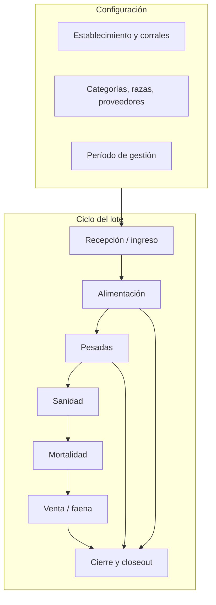

# SPEC — Módulo Feedlot (engorde bovino a corral)

**Versión:** 1.1  
**Fecha:** Junio 2026  
**Metodología:** SDD  
**Estado:** Aprobada (v1.0 + v1.5 en implementación)  
**Fecha aprobación:** Junio 2026  
**Referencia modelo:** `SPEC-MODULO-AVICOLA-HUEVOS.md` (módulo autocontenido con prefijo propio)  
**Relacionada con:** `SPEC-CAMPANA-TRANSVERSAL.md`, `SPEC-EXPEDIENTE-TRAZABILIDAD-CICLO-VIDA.md`, `CORE-Y-MODULOS.md` §5.1

---

## 1. Objetivo

Gestionar **engorde bovino en confinamiento (feedlot)**: ciclo batch desde **recepción de hacienda** hasta **faena o venta en pie**, con registro de **consumo de alimento** (inventario CORE), **pesadas**, **sanidad**, **mortalidad**, **indicadores zootécnicos** (GMD, conversión, mortalidad %) y **cierre económico por lote** (*closeout*).

El módulo debe ser **operable de punta a punta** por el operador de feedlot, con paridad funcional respecto a los módulos batch maduros del sistema (avícola huevos / carne, porcinos recría).

**Posicionamiento comercial:** plataforma agropecuaria integrada (campaña, inventario, finanzas CORE compartidos) — no replicar ERP contable ni integraciones hardware en v1.

---

## 2. Glosario agronómico

| Término | Definición |
|---------|------------|
| **Feedlot** | Establecimiento de engorde intensivo a corral; unidad de negocio del módulo. |
| **Corral / módulo** | Unidad física de confinamiento con capacidad en cabezas; aloja un lote activo a la vez (v1). |
| **Lote de engorde** | Unidad operativa batch: ingreso homogéneo de bovinos en un corral; ciclo típico 90–180 días. |
| **Período de gestión** | Entidad `core_campanas` (`SPEC-CAMPANA-TRANSVERSAL`). En UI: «Período de gestión». |
| **Plantel vivo** | Cabezas actualmente en el lote (`cabezasActuales`). |
| **Head days (cabezas-día)** | Σ (cabezas promedio × días) — denominador de costos por lote. |
| **Pesada** | Registro de peso promedio (muestra o total) en una fecha; base para GMD y proyección faena. |
| **Mortalidad** | Baja por muerte; **descuenta** `cabezasActuales` (regla ganadera estándar). |
| **Venta / faena** | Salida comercial; **descuenta** plantel; puede cerrar el lote. |
| **Hotelería / consignación** | Animales de terceros en el feedlot; el operador factura servicios de engorde. |
| **GMD / ADPV** | Ganancia media diaria = (peso actual − peso ingreso) ÷ días en feedlot. |
| **Conversión alimenticia (CA)** | kg alimento consumido ÷ kg ganados (idealmente en materia seca — MS). |
| **Closeout** | Reporte de cierre de lote: costos, ingresos, KPIs y margen. |
| **Deads-in / Deads-out** | Método de cálculo closeout: con o sin muertes en el denominador de costo/kg ganado. |
| **Bunk score** (v1.5) | Lectura visual del comedero para ajustar entrega de alimento. |
| **Breakeven** | Precio mínimo de venta ($/kg) para cubrir costos acumulados del lote. |

---

## 3. Módulo y seguridad

| Concepto | Valor |
|----------|--------|
| Código en `modules.code` | `FEEDLOT` |
| `@RequiresModule` | `"FEEDLOT"` |
| Origen inventario CORE | `InventoryOrigin.FEEDLOT` (nuevo valor en enum) |
| API base | `/api/feedlot` |
| Paquete Java | `com.agrocloud.feedlot` |
| Frontend | `agrogestion-frontend/src/modules/feedlot` |
| Prefijo tablas | `feedlot_*` |
| Nombre visible UI | **Engorde a corral (Feedlot)** |

**Concepto temporal UI** (registrar en `conceptosTemporalesPorModulo`):

| Campo | Valor |
|-------|--------|
| `etiquetaPeriodo` | Período de gestión |
| `unidadOperativa` | Lote de engorde |
| `ayuda` | Ciclos de 90–180 días por lote. El período agrupa consumos, faenas, KPIs y finanzas del módulo. |
| `rutaGestionPeriodos` | `configuracion/periodos` |

---

## 4. Situación actual (línea base)

| Área | Estado |
|------|--------|
| Módulo feedlot | **No existe** |
| Tablas `feedlot_*` | **No existen** |
| Backend / frontend | **No implementado** |
| Referencia en `BRIEF-PARA-INTERESADOS.md` | Mencionado como expansión futura campo–feedlot |
| `Plot` (cultivos) como corral | **No usar** — semántica agrícola; ver `CORE-Y-MODULOS.md` |

**Patrones reutilizables (sin copiar tablas):**

| Origen | Qué reutilizar |
|--------|----------------|
| Porcinos `Recria` | Modelo batch, `campana_id`, consumos, ventas |
| Avícola carne | Detalle lote con pestañas, resumen KPI, filtro `delPeriodoActivo` |
| Avícola huevos | Dominio aislado con prefijo propio |
| CORE | `CampanaContextService`, `InventoryService`, ingresos/egresos, recordatorios |
| Porcinos `ConsumoDiarioAutomaticoService` | Plantilla v2 para raciones teóricas |

---

## 5. Decisión arquitectónica de datos

### 5.1 Dominio propio `feedlot_*` (v1)

Tablas **independientes** de porcinos, avícola y cultivos. Misma empresa puede operar varios módulos sin colisión de datos.

**No reutilizar** `porcinos_recria` ni `avicola_lote`: reglas de plantel, KPIs y terminología son distintas.

### 5.2 Integración CORE

| Integración | Uso |
|-------------|-----|
| `core_campanas` | FK `campana_id` en lote y operaciones hijas |
| `Insumo` + `InventoryService` | Consumo alimento, medicamentos, suplementos |
| `Ingreso` / `Egreso` | Compra hacienda, venta faena, costos hotelería (opcional v1) |
| `Recordatorio` | Pesadas, vacunas, rotación dieta (v1.5) |
| Expediente trazabilidad | Tipo `FEEDLOT_LOTE` (v1.5) |

---

## 6. Entidades y tablas (v1)

### 6.1 Catálogos

| Tabla | Campos principales |
|-------|-------------------|
| `feedlot_establecimiento` | `id`, `empresa_id`, `nombre`, `ubicacion`, `capacidad_total_cabezas`, `activo`, auditoría |
| `feedlot_corral` | `id`, `establecimiento_id`, `nombre`, `capacidad_cabezas`, `estado` (`DISPONIBLE` \| `OCUPADO` \| `INACTIVO`) |
| `feedlot_categoria` | `id`, `empresa_id`, `nombre` (novillo, vaquillona, toro joven…), `activo` |
| `feedlot_raza` | `id`, `empresa_id`, `nombre` (Angus, Hereford, Brangus…), `activo` |
| `feedlot_motivo_muerte` | `id`, `empresa_id`, `nombre`, `activo` |
| `feedlot_proveedor_origen` | `id`, `empresa_id`, `nombre`, `tipo` (`PROPIETARIO` \| `CONSIGNATARIO` \| `CAMPO_PROPIO`), `activo` |

### 6.2 Lote y operaciones

| Tabla | Campos principales |
|-------|-------------------|
| `feedlot_lote` | `id`, `empresa_id`, `corral_id`, `campana_id`, `nombre`, `categoria_id`, `raza_id`, `proveedor_id`, `tipo_tenencia` (`PROPIO` \| `CONSIGNACION`), `fecha_ingreso`, `fecha_cierre`, `cabezas_inicial`, `cabezas_actuales`, `peso_promedio_ingreso_kg`, `precio_compra_kg` (opcional), `costo_hoteleria_dia` (opcional, consignación), `estado` (`ACTIVO` \| `CERRADO`), `observaciones`, auditoría |
| `feedlot_pesada` | `id`, `lote_id`, `fecha`, `peso_promedio_kg`, `cabezas_muestreadas`, `observaciones` |
| `feedlot_consumo` | `id`, `lote_id`, `campana_id`, `insumo_id`, `fecha`, `cantidad_kg`, `materia_seca_pct` (opcional), `observaciones` |
| `feedlot_muerte` | `id`, `lote_id`, `fecha`, `cabezas`, `motivo_id`, `observaciones` |
| `feedlot_evento_sanitario` | `id`, `lote_id`, `fecha`, `tipo` (`VACUNA` \| `TRATAMIENTO` \| `DIAGNOSTICO` \| `OTRO`), `descripcion`, `insumo_id` (opcional), `dias_retiro` (opcional, v2 enforcement) |
| `feedlot_venta` | `id`, `lote_id`, `campana_id`, `fecha`, `tipo` (`FAENA` \| `VENTA_EN_PIE` \| `DESCARTE`), `cabezas`, `peso_promedio_kg`, `precio_kg`, `total`, `comprador`, `ingreso_id` (opcional CORE), `observaciones` |
| `feedlot_ajuste_plantel` | `id`, `lote_id`, `fecha`, `cabezas_antes`, `cabezas_despues`, `motivo`, `usuario_id` — auditoría de correcciones |
| `feedlot_movimiento_corral` (v2) | Traslado parcial entre corrales / hospital |

### 6.3 Dietas (v1.5)

| Tabla | Campos principales |
|-------|-------------------|
| `feedlot_dieta` | `id`, `empresa_id`, `nombre`, `activo` |
| `feedlot_dieta_fase` | `id`, `dieta_id`, `nombre_fase`, `dias_desde_ingreso`, `kg_ms_cabeza_dia`, `insumo_id` (opcional, vínculo fórmula) |

### 6.4 Bunk management (v1.5)

| Tabla | Campos principales |
|-------|-------------------|
| `feedlot_lectura_comedero` | `id`, `lote_id`, `fecha`, `bunk_score` (0, ½, 1, 2…), `kg_entregados`, `observaciones` |

---

## 7. Reglas de negocio

### 7.1 Establecimiento y corral

| Regla | Detalle |
|-------|---------|
| RN-E01 | Todo corral pertenece a un establecimiento de la misma empresa. |
| RN-E02 | Un corral solo puede tener **un lote `ACTIVO`** a la vez (v1). |
| RN-E03 | Al crear lote en corral, estado corral → `OCUPADO`. |
| RN-E04 | Al cerrar el último lote activo del corral, estado corral → `DISPONIBLE`. |
| RN-E05 | No eliminar corral con lotes históricos; solo `INACTIVO`. |

### 7.2 Lote

| Regla | Detalle |
|-------|---------|
| RN-L01 | Al crear lote se asigna `campana_id` de la campaña activa (`CampanaContextService`). |
| RN-L02 | Estados: `ACTIVO` \| `CERRADO`. |
| RN-L03 | Campos obligatorios al alta: corral, nombre, fecha ingreso, cabezas inicial, peso promedio ingreso, categoría. |
| RN-L04 | `cabezas_actuales` inicial = `cabezas_inicial`. |
| RN-L05 | No operaciones de escritura en lote `CERRADO`. |
| RN-L06 | Escrituras bloqueadas si campaña activa está `CERRADA` (interceptor CORE). |
| RN-L07 | Cierre automático: venta/faena que deja `cabezas_actuales = 0` → `CERRADO`, `fecha_cierre = hoy`. |
| RN-L08 | Cierre manual: `POST /lotes/{id}/cierre` con confirmación si quedan cabezas > 0 (ajuste o venta pendiente documentada). |
| RN-L09 | `tipo_tenencia = CONSIGNACION`: no requiere `precio_compra_kg`; sí puede tener `costo_hoteleria_dia` para facturación. |

### 7.3 Mortalidad (diferencia clave vs avícola carne)

| Regla | Detalle |
|-------|---------|
| RN-M01 | Registra fila en `feedlot_muerte`. |
| RN-M02 | **Descuenta** `cabezas_actuales` del lote. |
| RN-M03 | `cabezas` ≤ `cabezas_actuales` al registrar. |
| RN-M04 | KPI: `mortalidad_pct = suma(muertes) / cabezas_inicial × 100`. |
| RN-M05 | No permitir muertes con fecha anterior a `fecha_ingreso`. |

### 7.4 Venta / faena

| Regla | Detalle |
|-------|---------|
| RN-V01 | Tipos: `FAENA`, `VENTA_EN_PIE`, `DESCARTE`. |
| RN-V02 | `cabezas` ≤ `cabezas_actuales`. |
| RN-V03 | Descuenta `cabezas_actuales`. |
| RN-V04 | Hereda `campana_id` del lote. |
| RN-V05 | Múltiples ventas parciales permitidas hasta agotar plantel. |
| RN-V06 | Opcional v1: crear `Ingreso` CORE si hay `precio_kg` y `total`. |
| RN-V07 | v2: bloquear faena si hay tratamiento dentro de `dias_retiro` (RN-S03). |

### 7.5 Consumo de alimento

| Regla | Detalle |
|-------|---------|
| RN-C01 | Registra en `feedlot_consumo` y egreso inventario con origen `FEEDLOT`. |
| RN-C02 | Falla transacción si inventario insuficiente (sin stock negativo salvo config explícita futura). |
| RN-C03 | Hereda `campana_id` del lote. |
| RN-C04 | Edición/eliminación revierte movimiento inventario (patrón huevos) — **v1**. |
| RN-C05 | Si `materia_seca_pct` informado: calcular `kg_ms = cantidad_kg × materia_seca_pct / 100` para KPIs. |

### 7.6 Pesadas

| Regla | Detalle |
|-------|---------|
| RN-P01 | Una o más pesadas por lote; la **más reciente** alimenta peso actual en KPIs. |
| RN-P02 | Campos: fecha, peso promedio (kg), cabezas muestreadas (opcional). |
| RN-P03 | GMD: `(pesoActual − pesoPromedioIngreso) / diasEnFeedlot`. |
| RN-P04 | Proyección faena (v1.5): `pesoProyectado = pesoActual + GMD × diasRestantesEstimados`. |

### 7.7 Sanidad

| Regla | Detalle |
|-------|---------|
| RN-S01 | Tipos: vacuna, tratamiento, diagnóstico, otro. |
| RN-S02 | Si vincula `insumo_id` (medicamento), opcional egreso inventario. |
| RN-S03 (v2) | Si `dias_retiro` > 0: faena bloqueada hasta `fecha + dias_retiro`. |

### 7.8 Ajuste de plantel

| Regla | Detalle |
|-------|---------|
| RN-A01 | Solo roles admin/supervisor. |
| RN-A02 | Registra `cabezas_antes`, `cabezas_despues`, motivo obligatorio. |
| RN-A03 | Actualiza `cabezas_actuales`; no borra historial de muertes/ventas. |

### 7.9 Indicadores (resumen de lote)

| Indicador | Fórmula v1 |
|-----------|------------|
| `diasEnFeedlot` | `hoy − fechaIngreso` (o `fechaCierre − fechaIngreso` si cerrado) |
| `cabezasActuales` | Valor persistido (muertes y ventas lo modifican) |
| `mortalidadPct` | `suma(muertes) / cabezasInicial × 100` |
| `pesoActualKg` | Última pesada o `pesoPromedioIngreso` si no hay pesadas |
| `kgGanados` | `(pesoActual − pesoIngreso) × cabezasActuales` (aprox. lote) |
| `gmd` | `(pesoActual − pesoIngreso) / diasEnFeedlot` |
| `totalAlimentoKg` | Σ consumos |
| `totalAlimentoMsKg` | Σ consumos con MS calculada |
| `conversionAlimenticia` | `totalAlimentoKg / kgGanados` (si kgGanados > 0) |
| `consumoCabDia` | `totalAlimentoKg / headDays` |
| `headDays` | Σ días × cabezas promedio por intervalo (v1 simplificado: `cabezasActualesPromedio × diasEnFeedlot`) |
| `costoAcumulado` | Compra + Σ consumos valorizados + Σ sanidad + hotelería |
| `breakevenKg` | `costoAcumulado / (cabezasActuales × pesoActual)` (si aplica) |
| `margenEstimado` | Σ ingresos ventas − costoAcumulado |

**Closeout — método deads-in (default v1):** los costos de animales muertos permanecen en el lote; el denominador de costo/kg ganado usa cabezas que salieron vivas + muertas según configuración empresa (`metodo_closeout`: `DEADS_IN` \| `DEADS_OUT`).

---

## 8. Ciclo productivo (flujo usuario)



**Tareas calendario sugeridas (v1.5):** ingreso (día 0), pesadas días 30/60/90/120, ventana faena según peso objetivo, recordatorios sanidad según protocolo del establecimiento.

---

## 9. API REST (contrato v1)

Base: `/api/feedlot` — `@RequiresModule("FEEDLOT")`.

Headers: `X-Campaign-Id` en escrituras (patrón CORE).

### 9.1 Catálogos

| Método | Ruta | Descripción |
|--------|------|-------------|
| GET/POST/PUT | `/establecimientos` | CRUD establecimientos |
| GET/POST/PUT | `/establecimientos/{id}/corrales` | CRUD corrales |
| GET/POST/PUT | `/categorias` | CRUD categorías |
| GET/POST/PUT | `/razas` | CRUD razas |
| GET/POST/PUT | `/motivos-muerte` | CRUD motivos |
| GET/POST/PUT | `/proveedores` | CRUD proveedores/origen |

### 9.2 Lotes

| Método | Ruta | Descripción |
|--------|------|-------------|
| GET | `/lotes?estado=&delPeriodoActivo=&corralId=` | Listado |
| GET | `/lotes/{id}` | Detalle |
| POST | `/lotes` | Alta |
| PUT | `/lotes/{id}` | Edición (solo lote ACTIVO; campos acotados) |
| POST | `/lotes/{id}/cierre` | Cierre manual |
| GET | `/lotes/{id}/resumen` | KPIs y closeout parcial |
| GET | `/lotes/{id}/closeout` | Reporte closeout (JSON; PDF v1.5) |

**Body alta (`FeedlotLoteSolicitud`):**

```json
{
  "corralId": 1,
  "nombre": "Lote Norte A - Mar 2026",
  "categoriaId": 2,
  "razaId": 1,
  "proveedorId": 3,
  "tipoTenencia": "PROPIO",
  "fechaIngreso": "2026-03-15",
  "cabezasInicial": 120,
  "pesoPromedioIngresoKg": 280.5,
  "precioCompraKg": 850.00,
  "observaciones": ""
}
```

### 9.3 Operaciones por lote

| Método | Ruta | Descripción |
|--------|------|-------------|
| GET/POST/PUT/DELETE | `/lotes/{id}/pesadas` | Pesadas |
| GET/POST/PUT/DELETE | `/lotes/{id}/consumos` | Consumos alimento |
| GET/POST | `/lotes/{id}/muertes` | Mortalidad |
| GET/POST/PUT/DELETE | `/lotes/{id}/eventos-sanitarios` | Sanidad |
| GET/POST | `/lotes/{id}/ventas` | Ventas / faena |
| POST | `/lotes/{id}/ajustes-plantel` | Ajuste auditado (admin) |

### 9.4 Panel y reportes

| Método | Ruta | Descripción |
|--------|------|-------------|
| GET | `/panel/resumen` | KPIs empresa / período activo |
| GET | `/reportes/analisis-lotes` | Comparativa GMD, CA, mortalidad, margen |
| GET | `/reportes/lote/{id}/curva-peso` | Serie pesadas + proyección (v1.5) |
| GET | `/reportes/exportar` | Excel lotes del período (v1.5) |

---

## 10. Frontend — pantallas objetivo

| # | Pantalla | Prioridad | Fase |
|---|----------|-----------|------|
| 1 | `FeedlotDashboardScreen` — panel KPIs | Alta | v1 |
| 2 | `EstablecimientosFeedlotScreen` + corrales | Alta | v1 |
| 3 | `CategoriasFeedlotScreen`, `RazasFeedlotScreen`, `ProveedoresFeedlotScreen` | Media | v1 |
| 4 | `LotesFeedlotScreen` + **formulario alta/edición** | **Crítica** | v1 |
| 5 | `DetalleLoteFeedlotScreen` — pestañas: Resumen, Pesadas, Consumos, Muertes, Sanidad, Ventas | **Crítica** | v1 |
| 6 | `CloseoutLoteScreen` o modal en detalle | Alta | v1 |
| 7 | `InsumosFeedlotScreen` (reutilizar patrón insumos unificados) | Media | v1 |
| 8 | `ReportesFeedlotScreen` | Alta | v1.5 |
| 9 | `CalendarioFeedlotScreen` | Media | v1.5 |
| 10 | `GestionCampanasScreen` (incrustado) | Alta | v1 |
| 11 | Trazabilidad expediente `FEEDLOT_LOTE` | Media | v1.5 |

**Rutas objetivo v1:**

- `/feedlot/panel`
- `/feedlot/lotes`, `/feedlot/lotes/nuevo`, `/feedlot/lotes/:id`
- `/feedlot/establecimientos`, `/feedlot/establecimientos/:id/corrales`
- `/feedlot/categorias`, `/feedlot/razas`, `/feedlot/proveedores`
- `/feedlot/insumos`
- `/feedlot/configuracion/periodos`

---

## 11. Alcance por versión

### 11.1 v1 — MVP operativo (mínimo comercial)

1. Migración Flyway: tablas §6.1–6.2 + registro módulo `FEEDLOT` + permisos.
2. Backend completo: catálogos, lotes, operaciones, resumen KPI, closeout JSON básico.
3. Frontend punta a punta: alta lote → operaciones → cierre → closeout.
4. Integración inventario CORE (`InventoryOrigin.FEEDLOT`).
5. Filtro `delPeriodoActivo` en listados.
6. Consignación: flag `tipo_tenencia` + campos opcionales (sin facturación automática hotelería).
7. Edición/reversión consumos con inventario.
8. Ajuste plantel auditado (admin).
9. Tests unitarios/integración: plantel, mortalidad descuenta, venta parcial, campaña cerrada.

### 11.2 v1.5 — Gestión y analítica

1. Reportes empresa + gráficos (GMD, CA, mortalidad, margen por proveedor).
2. Proyección peso / fecha faena y breakeven dinámico.
3. Dietas por fase + consumo teórico vs real (job opcional, patrón porcinos).
4. Bunk score / lectura comederos.
5. Calendario ámbito `FEEDLOT`.
6. Closeout PDF exportable.
7. Expediente trazabilidad `FEEDLOT_LOTE` (`SPEC-EXPEDIENTE-TRAZABILIDAD-CICLO-VIDA.md`).
8. Export Excel comparativa lotes.
9. Configuración `metodo_closeout` (deads-in / deads-out) por empresa.

### 11.3 v2 — Premium / integraciones

1. Caravana individual y movimientos entre corrales.
2. Corral hospital / pulls.
3. Retiro medicamentos con bloqueo faena.
4. App móvil offline (pesada, muerte, tratamiento en corral).
5. Importación balanza mixer / bastón RFID.
6. Peso carne / rendimiento frigorífico (RP).
7. Mapa visual del yard.
8. Alertas inteligentes (caída consumo, pico mortalidad).
9. Integración Cuota 481 / SENASA (con asesoría regulatoria).

### 11.4 Excluido (todas las fases iniciales)

- Contabilidad double-entry completa (usar finanzas CORE).
- Reproducción / cría bovina (módulo futuro «ganadería extensiva»).
- Uso de `Plot` agrícola como corral.
- Integración hardware obligatoria en MVP.
- Blockchain / QR en etiqueta física.

---

## 12. Actualizaciones a SPECs relacionadas (post-aprobación)

| Documento | Cambio |
|-----------|--------|
| `SPEC-CAMPANA-TRANSVERSAL.md` | Fila feedlot en matriz FKs; concepto temporal — **actualizado** |
| `SPEC-EXPEDIENTE-TRAZABILIDAD-CICLO-VIDA.md` | Tipo `FEEDLOT_LOTE` (v1.5) — **anotado** |
| `DISENO-TECNICO-MODULO-FEEDLOT-v1.5.md` | Diseño técnico v1.5 — **Implementada Junio 2026** |
| `InventoryOrigin.java` | Valor `FEEDLOT` |
| `conceptosTemporalesPorModulo.ts` | Entrada `feedlot` |
| `configuracionesExpediente.ts` | Alcance feedlot |

---

## 13. Benchmark mercado (referencia funcional)

| Capacidad | WinCampo / CattleXpert | AgroGestion v1 | v1.5 / v2 |
|-----------|------------------------|----------------|-----------|
| Lote + corral | ✅ | ✅ | |
| Consumo alimento | ✅ | ✅ | |
| Pesadas + GMD | ✅ | ✅ | |
| Closeout económico | ✅ | ✅ básico | ✅ PDF |
| Consignación / hotelería | ✅ | ✅ flag | ✅ facturación |
| Bunk score | ✅ | | ✅ |
| Dietas por fase | ✅ | | ✅ |
| Caravana / RFID | ✅ | | ✅ |
| App móvil corral | ✅ | | ✅ |
| Multi-módulo agro integrado | Parcial | ✅ **diferenciador** | |

---

## 14. Decisiones aprobadas (Junio 2026)

| ID | Tema | Decisión aprobada |
|----|------|-------------------|
| R01 | Gestión individual | **Solo lote/corral** en v1; caravana individual en v2 |
| R02 | Mortalidad | **Descuenta** `cabezasActuales` (estándar ganadero) |
| R03 | Corral único | **Un lote activo** por corral en v1 |
| R04 | Mezcla lotes | **No** mezclar lotes en un corral en v1 |
| R05 | Consignación / hotelería | **Flag + campos básicos** (`tipoTenencia`, `costoHoteleriaDia`) en v1; facturación automática en v1.5 |
| R06 | Closeout | **Deads-in** fijo en v1; configurable por empresa en v1.5 |
| R07 | Materia seca | **Opcional** en consumos; KPIs usan MS solo si se informa `materiaSecaPct` |
| R08 | Precio compra | **Opcional** en v1; closeout/margen solo cuando hay precios cargados |
| R09 | Faena parcial | **Múltiples ventas/faenas parciales** permitidas |
| R10 | Nombre módulo UI | UI: **«Engorde a corral (Feedlot)»**; código técnico: `FEEDLOT` |

**Diseño técnico:** ver [`DISENO-TECNICO-MODULO-FEEDLOT.md`](DISENO-TECNICO-MODULO-FEEDLOT.md) (v1 aprobada) y [`DISENO-TECNICO-MODULO-FEEDLOT-v1.5.md`](DISENO-TECNICO-MODULO-FEEDLOT-v1.5.md) (v1.5 implementada).

---

## 15. Criterios de aceptación (v1 + v1.5)

### Actores de prueba (obligatorio)

| Actor | Usuario típico | Alcance en QA |
|-------|----------------|---------------|
| **Plataforma (SUPERADMIN)** | `superman` — solo habilitar módulo, empresas, usuarios globales (`/api/admin-global`) | Criterio «Admin activa módulo FEEDLOT». **No** usar para recorrer operación diaria: el interceptor omite validación `@RequiresModule`. |
| **Administrador de empresa** | `admin@agrocloud.com` / `admin123` en local ([`DataInitializer`](../../agrogestion-backend/src/main/java/com/agrocloud/config/DataInitializer.java), [`GUIA_DEMO_CLIENTE.md`](../../agrogestion-backend/GUIA_DEMO_CLIENTE.md)) | CRUD lotes, operaciones, closeout, reportes, calendario, expediente, config closeout. Empresa: **AgroCloud Demo**. |
| **Operario / supervisor** | Usuario con rol `OPERARIO` o `SUPERVISOR` en la misma empresa (opcional) | Validar permisos write vs read y ajuste plantel (solo admin/supervisor). |

Scripts demo: [`HABILITAR_FEEDLOT_EMPRESA_DEMO.sql`](../../agrogestion-backend/scripts/HABILITAR_FEEDLOT_EMPRESA_DEMO.sql) + [`INSERTAR_LOTE_DEMO_FEEDLOT.sql`](../../agrogestion-backend/scripts/INSERTAR_LOTE_DEMO_FEEDLOT.sql). Guía: [`README-FEEDLOT-DEMO.md`](../../agrogestion-backend/scripts/README-FEEDLOT-DEMO.md).

### v1 operativa
- [x] Admin **plataforma** activa módulo `FEEDLOT` para una empresa de prueba.
- [x] **Usuario de empresa** crea establecimiento, corrales, categorías y razas.
- [x] Usuario crea lote desde `/feedlot/lotes/nuevo` asignando corral disponible.
- [x] Corral pasa a `OCUPADO`; no se puede crear segundo lote activo en el mismo corral.
- [x] Usuario registra consumo, pesada, muerte, sanidad y venta.
- [x] Mortalidad y venta reducen `cabezas_actuales` correctamente.
- [x] Faena total cierra lote; corral vuelve a `DISPONIBLE`.
- [x] Resumen muestra GMD, conversión y mortalidad coherentes.
- [x] Closeout JSON/PDF muestra costos, head days y margen (si hay precios).
- [x] Listado filtra por período activo (`delPeriodoActivo=true`).
- [x] Escrituras bloqueadas con campaña cerrada.
- [x] Ajuste plantel solo admin, con auditoría.
- [x] `@RequiresModule("FEEDLOT")` en todos los endpoints del módulo.

### v1.5 analítica y transversal
- [x] Reportes empresa + gráficos (GMD, CA, mortalidad, margen).
- [x] Proyección peso / curva peso y breakeven en reportes.
- [x] Dietas por fase + consumo teórico vs real.
- [x] Bunk score / lecturas comederos.
- [x] Calendario ámbito `FEEDLOT`.
- [x] Closeout PDF exportable.
- [x] Expediente trazabilidad `FEEDLOT_LOTE`.
- [x] Export Excel comparativa lotes.
- [x] Configuración `metodo_closeout` (deads-in / deads-out) por empresa.

### QA E2E manual en browser (usuario de empresa)

Ejecutar con **`admin@agrocloud.com`** → empresa **AgroCloud Demo** (no superman).

| # | Ruta / acción | Resultado esperado |
|---|---------------|-------------------|
| 1 | `/feedlot/panel` | KPIs sin error |
| 2 | `/feedlot/lotes/{id}` (lote demo) | Pestañas Pesadas, Consumos, Comederos, Dieta, curva peso |
| 3 | Closeout modal + PDF | JSON y descarga PDF OK |
| 4 | `/feedlot/reportes` | Gráficos + export Excel |
| 5 | `/feedlot/dietas` | CRUD dieta/fase; asignar dieta en formulario lote |
| 6 | `/feedlot/calendario` | Eventos ámbito `FEEDLOT` |
| 7 | `/feedlot/expediente` | PDF `FEEDLOT_LOTE` |
| 8 | `/feedlot/configuracion/closeout` | Selector deads-in / deads-out |
| 9 | POST con campaña `CERRADA` | Escritura rechazada (400) |

---

## 16. Plan de implementación sugerido (post-aprobación SPEC)

1. ~~SPEC aprobada~~ ✅ Junio 2026.  
2. **Diseño técnico breve** (`DISENO-TECNICO-MODULO-FEEDLOT.md`) — aprobación explícita.  
3. **Flyway** `V1_153__Modulo_feedlot.sql` — tablas + módulo + `InventoryOrigin.FEEDLOT`.  
4. **Backend** — entidades, repos, servicios (lote, operaciones, KPIs, closeout).  
5. **Tests** — reglas RN-M*, RN-V*, RN-L*, campaña cerrada.  
6. **Frontend** — módulo `feedlot/` (menu, routes, pantallas v1).  
7. **Integración** — campaña, insumos, panel admin módulos.  
8. **QA E2E** — con `admin@agrocloud.com` en AgroCloud Demo (ver §15 actores); no superman para flujo operativo.  
9. **v1.5** — amend SPEC 1.1: reportes, dietas, expediente.

---

## 17. Referencias

| Área | Ruta / fuente |
|------|----------------|
| Arquitectura módulos | `docs/CORE-Y-MODULOS.md` §5.1 |
| Campaña transversal | `docs/specs/SPEC-CAMPANA-TRANSVERSAL.md` |
| Modelo batch referencia | `docs/specs/SPEC-MODULO-AVICOLA-CARNE.md`, porcinos `Recria` |
| Módulo aislado referencia | `docs/specs/SPEC-MODULO-AVICOLA-HUEVOS.md` |
| Expediente | `docs/specs/SPEC-EXPEDIENTE-TRAZABILIDAD-CICLO-VIDA.md` |
| Demo / QA Feedlot | `agrogestion-backend/scripts/README-FEEDLOT-DEMO.md` |
| Mercado AR | WinCampo, Vacuno360 (benchmark funcional) |

---

**Aprobación SPEC funcional:** Producto / stakeholders — **Junio 2026**  
**Próximo paso SDD:** v1 + v1.5 implementadas — completar QA E2E manual §15 con usuario de empresa (`admin@agrocloud.com`).
